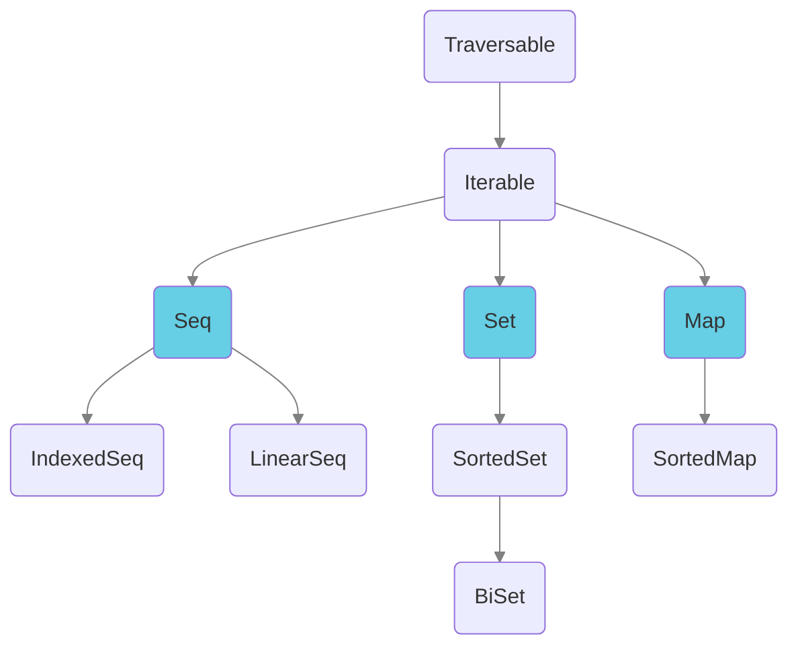

```mermaid
graph TD
    A(Traversable) --> B(Iterable)
    B --> C(Seq)
    B --> D(Set)
    B --> E(Map)
    C --> F(IndexedSeq)
    C --> G(LinearSeq)
    D --> H(SortedSet)
    H --> I(BiSet)
    E --> J(SortedMap)

    classDef Red fill:#00AED499;
    class C,D,E Red;
    
    linkStyle default fill: none, stroke: grey;
```
